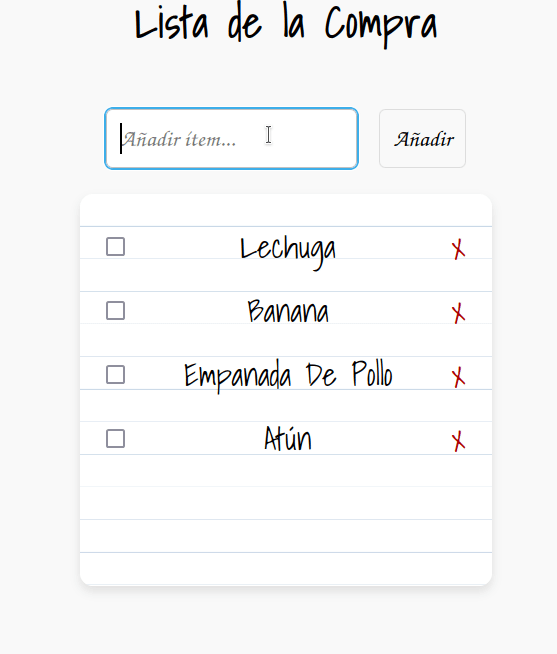
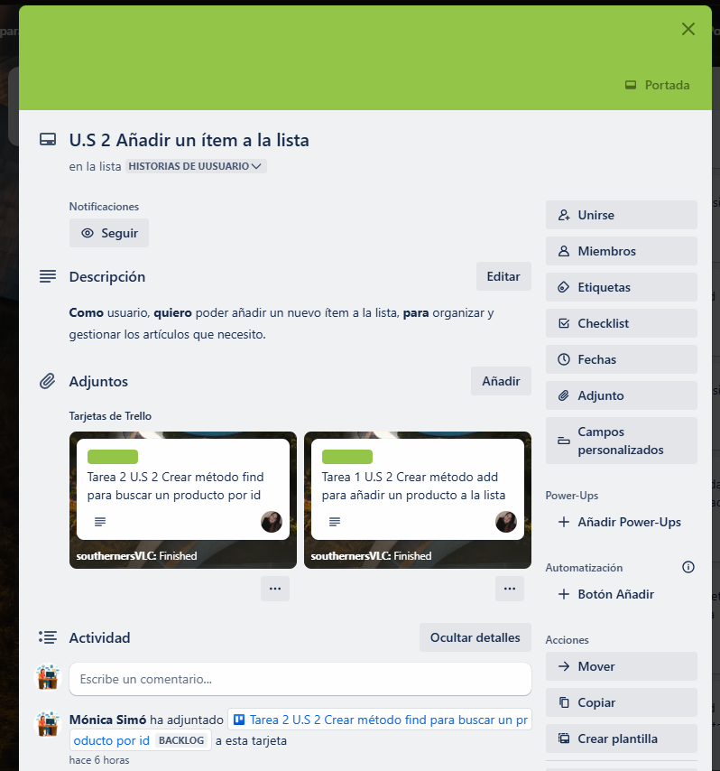

# 🛒 **App ShopList**

## 📝 **Introduction**

In this exercise, we will create a web application that communicates with a database to manage information. We will use technologies like Spring Boot, JPA, and H2 to build this connection.
This list will allow you to manage items that you want to add, modify, and delete, implementing the basic CRUD operations (Create, Read, Update, Delete) on an in-memory browser list.

- **Create**: The user will be able to add new items to the list.
- **Read**: When loading the page, the list will display the existing items.
- **Delete**: Items can be deleted individually.
- **Modify**: Items can be marked as purchased or not purchased.

---

# ⚡ **App preview:**

---
## 📦 **App Structure**
    |--- src
        |--- main
            |--- java
                |---com.example.ShoppingListBackend
                        |--- Product
                        |--- ProductController
                        |--- ProductRepository
                        |--- ShoppingListBackendApplication
        |--- test
           |--- java

## 📊 **Trello General**

## 🗂️ **Trello Task**

---

## 🎯 **Knowledge targets**

1. **REST API with Spring Boot**: Develop a backend using Spring Boot that exposes a REST API to interact with a frontend.
2. **Frontend and Backend Connection**: Connect the user interface (frontend) with the backend's REST API, storing data in an H2 database.
3. **Managing IDs with API**: Learn how to handle unique identifiers (IDs) provided by an API for each item, ensuring CRUD operations are synchronized between the frontend application and the API.

---

## 💻 Technology Stack:

---

## 🌐 Authors

- **Mònica Simó**                      
   
  
- **Sergi Asins**                      
   
  
- **Paola Perdomo**                      
   
  
- **Miguel Reyes**                              
   
  
